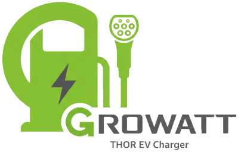

[](https://ko-fi.com/bobbesnl)

[](https://github.com/hacs/integration)


⚠️ **Please read this document first before installing this integration!**



⚡ **Unofficial Home Assistant integration for the Growatt THOR EV charger**  

This integration allows you to connect a Growatt THOR EV charger **directly to Home Assistant** using **OCPP 1.6 over WebSocket**, providing local control without relying on the Growatt cloud.

Tested on:
- THOR 22AS with FW version 2.2.16-20240902 (but it should be working on all THOR 11/22AS-S/P/SE/PE versions.)

Do you have another Growatt EV charger? Please test it with the integration and let me know if it is working. If you open up an issue and provide logs, I will try to add your charger to be supported (Growatt only!).

> ⚠️ This is an **unofficial community project**. Growatt is not affiliated with or endorsing this integration in any way.

---

## ⚠️ Known Issues

### Thor Firmware Instability & Random Reboots

The Growatt Thor charger has **known firmware bugs** that can cause crashes and unexpected reboots, particularly during:
- Multiple rapid configuration changes
- Concurrent polling and command execution
- High message frequency on the OCPP connection

**Protective Measures Implemented:**
- Write queue with 20-second rate limiting
- Automatic polling pause during config writes
- Command deduplication for rapid UI changes
- Smart timing delays

⚠️ **Important**: While these protections significantly reduce crashes, they **cannot guarantee** complete stability due to Thor's firmware limitations.

**📢 Help Us Improve!**
Experiencing crashes or random reboots? Please [open an issue](https://github.com/bobbesnl/growatt_thor/issues) with:
- Thor firmware version (from diagnostics)
- Home Assistant logs (around crash time)
- Actions that triggered the reboot
- Diagnostic file download

Your feedback helps identify patterns and improve integration stability! 🙏

---

## Features

### 📊 Real-time Monitoring
- **Charger status**: Idle, Preparing, Charging, Finishing, Faulted, Unavailable
- **Power monitoring**: Total power and per-phase (L1, L2, L3) in Watts
- **Current monitoring**: Current draw per phase in Amperes
- **Voltage monitoring**: Voltage per phase
- **Energy tracking**: Session energy in kWh with automatic reset per session
- **Temperature**: Internal charger temperature in °C
- **Transaction tracking**: Active transaction ID and charging session details (saved in sensor.growatt_thor_ev_charger_last_sessions)
- **Energy Dashboard compatible charging sensors**

### 🔌 Grid & Load Balancing
- **External meter monitoring**: Real-time grid power, voltage, and current per phase
- **Dynamic load balancing**: Set maximum grid import limit (kW) to prevent overload
- **Smart polling**: Configurable polling interval (5-3600 sec. recommended setting 30 seconds)
  - ⚠️ **Note**: Polling interval only affects the frequency of grid data **display updates** in Home Assistant. Load balancing functionality itself operates independently and responds in real-time regardless of the polling setting.
- **Wiring detection**: Automatic 1-phase or 3-phase detection

### ⚙️ Configuration & Control
- **Max current control**: Set maximum charging current (6-32A)
- **Charging schedule**: Configure automatic start/stop times
- **Charger modes**: Switch between Plug & Charge, RFID only, HomeAssistant(HA)/RFID mode
- **Manual charging control**: Start and stop charging sessions via buttons
- **Load balancing toggle**: Enable/disable dynamic load balancing
- **Auto update THOR time**: Auto sync time with server time at every heartbeat and with reboot (ocpp protocol)
- **AP Mode Activation**: Added ability to enable AP (Access Point) mode directly from Home Assistant via integration configuration menu
    - Accessible through Settings → Devices & Services → Growatt THOR → Configure
    - Includes safety confirmation dialog to prevent accidental activation
    - Uses OCPP DataTransfer with messageId="appconfigmode" (discovered via PCAP analysis)
    - THOR broadcasts WiFi network (typically serialno based SSID) for direct configuration when activated

### 📈 Session History
- **Current session tracking**: Real-time updates during active charging

## 📋 Session Logging & Data Export

This integration automatically logs every completed charging session to a local CSV file. This is useful for subsidy programs (such as ERE certificates in the Netherlands) that require annual reports with per-session charging data.

### How It Works

After each completed charging session, the following data is automatically appended to `/config/growatt_thor_sessions.csv`:

| Field | Description |
|---|---|
| `charger_id` | Unique charger identifier (serial number) |
| `location` | Charger address as configured during setup |
| `start_time` | Charging session start time |
| `end_time` | Charging session end time |
| `energy_kwh` | Energy delivered during session (kWh) |
| `cost` | Session cost as reported by charger |
| `duration_minutes` | Session duration in minutes |
| `transaction_id` | OCPP transaction ID |

### Initial Setup

When adding the integration, enter the **exact installation address** of the charger in the **Location** field. This address will be included in every exported session report.

You can update the location at any time via **Settings → Devices & Services → Growatt THOR → Configure**

### Exporting Session Data

Use the built-in action to export sessions for a specific date range:

**Via Developer Tools → Actions:**

```yaml
action: growatt_thor.export_sessions
data:
  date_from: "2026-01-01"
  date_to: "2026-12-31"
```

After the action completes, a notification appears in Home Assistant with a direct download link to the generated CSV file.

**Note:** The export file is saved to `/config/www/` and is accessible via `/local/` in your browser. The file is named `growatt_thor_export_YYYY-MM-DD_YYYY-MM-DD.csv`.

**Note:** for spreadsheet users: When opening the CSV in LibreOffice Calc or Microsoft Excel, ensure the decimal separator is set to . (dot) to correctly display energy values such as 0.068.

### Lovelace UI — Export Panel

**Add a export panel for a convenient export interface without needing Developer Tools**

First add this script: **Settings -> Automations and scenes -> Scripts -> Add script**
```yaml
alias: Growatt Export Sessions
sequence:
  - action: growatt_thor.export_sessions
    data:
      date_from: "{{ states('input_text.growatt_export_date_from') }}"
      date_to: "{{ states('input_text.growatt_export_date_to') }}"
mode: single
```

Then add the required helpers in **Settings → Helpers → Add Helper → Text:**
- **input_text.growatt_export_date_from** — default value: current year start e.g. 2026-01-01
- **input_text.growatt_export_date_to** — default value: today e.g. 2026-12-31


Add this card to your dashboard:

```yaml
type: vertical-stack
cards:
  - type: markdown
    content: |
      ## 📋 Export Charging Sessions
      Fill in the date range and press **Export** to generate a CSV download.
  - type: entities
    entities:
      - entity: input_text.growatt_export_date_from
        name: From (YYYY-MM-DD)
      - entity: input_text.growatt_export_date_to
        name: To (YYYY-MM-DD)
  - type: button
    name: Export Sessions
    icon: mdi:file-download-outline
    tap_action:
      action: call-service
      service: script.growatt_export_sessions
```

Example Export Output:

```yaml
charger_id,location,start_time,end_time,energy_kwh,cost,duration_minutes,transaction_id
XGJ00003214700CA,"Kerkstraat 1, 1234 AB Amsterdam",2026-03-21 08:19:03,2026-03-21 09:42:02,3.170,0.63,83.0,1
XGJ00003214700CA,"Kerkstraat 1, 1234 AB Amsterdam",2026-03-22 07:05:11,2026-03-22 08:31:44,8.450,1.69,86.5,2
```

## 🛡️ Stability Features
- **Write queue system**: Intelligent buffering of all configuration writes with 15-second rate limiting
- **Anti-crash protection**: 20-second polling pause after each configuration change to prevent Thor firmware crashes
- **Sequential write operations**: Multiple rapid changes are automatically queued and executed safely
- **TIER 2 error recovery**: Robust error handling for connection issues
- **Smart polling**: Only polls external meter when load balancing is enabled
- **Queue visibility**: Real-time logging of queued operations and wait times

---

## Architecture

```
Growatt THOR EV Charger
    ↓ OCPP 1.6 (WebSocket, unencrypted)
Home Assistant (Local OCPP Server)
```

The integration runs a **local OCPP 1.6 server** inside Home Assistant. The Growatt THOR charger connects directly to this server instead of the Growatt cloud backend, providing:
- **Local control**: No internet dependency for basic operations
- **Privacy**: Charging data stays local
- **Reliability**: No cloud service interruptions
- **Speed**: Instant updates without cloud round-trips

---

## Installation

### Prerequisites
- Home Assistant (2024.4.1 or newer recommended)
- HACS (Home Assistant Community Store) installed (minimum v1.34.0 but most latest version is recommended)
- Working Growatt THOR EV Charger setup --> Fully configured to work with your (hybrid) inverter and with a working network connectivity to Growatt cloud (Shinephone app)
- Network access between Home Assistant server and the charger

### Via HACS (Recommended)

1. **Install the integration**
   - Open **Home Assistant**
   - Go to **HACS → Integrations**
   - Click **Explore & Download Repositories** (wording may differ per HACS version)
   - Search for **Growatt THOR** (or **Growatt THOR EV Charger**)
   - Click **Download**
   - Restart Home Assistant

### Alternative: Add repository manually to HACS (Custom repository)

Use this if you cannot find the integration in the default HACS list yet, or if you intentionally want to install from a fork/branch.

1. **Add custom repository**
   - Open **Home Assistant**
   - Go to **HACS → Integrations**
   - Click **⋮** (three dots) → **Custom repositories**
   - Add repository:
     - **URL**: `https://github.com/bobbesnl/growatt_thor`
     - **Category**: `Integration`
   - Click **Add**

2. **Install the integration**
   - Search for **Growatt THOR** (or **Growatt THOR EV Charger**) in HACS
   - Click **Download**
   - Restart Home Assistant

### Configure the integration

1. Go to **Settings → Devices & Services**
2. Click **+ Add Integration**
3. Search for **Growatt THOR**
4. Configure:
   - **Listen IP**: `0.0.0.0` (default, listens on all interfaces)
   - **Listen Port**: `9000` (default, or choose your own)
   - **Grid Poll Interval**: `30` seconds (recommended)
     - Range: 5-3600 seconds
     - Lower values = more frequent updates (higher load on THOR)
     - Higher values = less frequent updates (lower load)
     - **Important**: This only affects display update frequency, not load balancing functionality
5. Click **Submit**

Home Assistant is now ready and waiting for the charger to connect.

---

## Configuring the Growatt THOR Charger

### ⚠️ Important Notes

- Changing the server URL will **disconnect the charger from Growatt cloud**
- You will **lose access to the Growatt app** while using this integration
- Make sure you know how to **restore the original settings** via AP mode
- **Test the server URL** before saving to avoid lockout

### Configuration Methods

#### Method 1: Via AP Mode (Most Reliable)

1. **Enable AP Mode** on the Growatt THOR charger (via Shinephone app)
2. Connect your phone to the THOR's Wi-Fi (Standard Wi-Fi password is `12345678`)
3. Open the **ShinePhone** or **Growatt** app
4. Navigate to **Network Settings** or **Server Settings**
5. Change the **Server URL** to:
   ```
   ws://<HOME_ASSISTANT_IP>:9000/ocpp/ws
   ```
   Example: `ws://192.168.1.101:9000/ocpp/ws`
6. **Save** and **reboot** the charger
7. Reconnect the charger to your normal Wi-Fi network

#### Method 2: Via Web Interface (Some Models)

Some Thor models have a web interface accessible via LAN cable:

1. Connect a network cable to the Thor charger
2. Set a static IP on your computer (e.g., `192.168.1.13`)
3. Open a browser and navigate to `http://192.168.1.5:8080`
4. Change the server URL as described above
5. Save and reboot

### Verification

After configuration, check Home Assistant:
- Go to **Settings → Devices & Services**
- The Growatt THOR device should appear with status "Connected"
- Sensors should start showing live data

---

## Switching Back to Growatt Cloud

If you need to restore cloud connectivity:

### Via AP Mode

1. Enable **AP Mode** on the charger. Best practice to do so is set up a TCP forwarder (see underneath), connect to charger via ShinePhone app (delete existing THOR and add again to regain acces)
2. Connect to the charger's Wi-Fi
3. Open the Growatt app
4. Restore the original server URL:
   ```
   ws://evcharge.growatt.com:80/ocpp/ws
   ```
5. Save and reboot

### Emergency Fallback: TCP Forwarder

If you're locked out and need temporary cloud access:

1. Install **Advanced SSH & Web Terminal** add-on in Home Assistant
2. Install `socat`:
   ```bash
   apk add socat
   ```
3. Run TCP forwarder:
   ```bash
   /usr/bin/socat TCP-LISTEN:9000,fork,reuseaddr TCP:evcharge.growatt.com:80
   ```
4. This forwards traffic from port 9000 to Growatt cloud
5. Charger will reconnect to cloud via Home Assistant
6. Use Growatt app to restore original server URL
7. Stop socat and restore this integration

⚠️ **Note**: If you get "address in use" errors, temporarily remove the integration and restart Home Assistant before running socat.

---

## Usage

### Entities Created

After successful connection, the following entities are created:

#### Sensors
- `sensor.growatt_thor_ev_charger_status` - Charger status
- `sensor.growatt_thor_ev_charger_power` - Total charging power (W)
- `sensor.growatt_thor_ev_charger_energy` - Session energy (kWh)
- `sensor.growatt_thor_ev_charger_current_l1/l2/l3` - Current per phase (A)
- `sensor.growatt_thor_ev_charger_voltage_l1/l2/l3` - Voltage per phase (V)
- `sensor.growatt_thor_ev_charger_power_l1/l2/l3` - Power per phase (W)
- `sensor.growatt_thor_ev_charger_temperature` - Internal temperature (°C)
- `sensor.growatt_thor_ev_charger_grid_power` - Grid connection power (W)
- `sensor.growatt_thor_ev_charger_transaction_id` - Active transaction ID
- `sensor.growatt_thor_ev_charger_last_session_energy` - Previous session energy
- `sensor.growatt_thor_ev_charger_last_session_cost` - Previous session cost
- `sensor.growatt_thor_ev_charger_ev_charger_last_sessions` - Session tracking (only last 5 sessions)

#### Controls
- `number.growatt_thor_ev_charger_max_current` - Maximum charging current (6-32A)
- `number.growatt_thor_ev_charger_load_balancing_limit` - Grid import limit (kW)
- `switch.growatt_thor_ev_charger_load_balancing` - Enable/disable load balancing
- `select.growatt_thor_ev_charger_charger_mode` - Charging mode (Plug&Charge/RFID only/HA&RFID)
- `button.growatt_thor_ev_charger_start_charging` - Manual start
- `button.growatt_thor_ev_charger_stop_charging` - Manual stop
- `button.growatt_thor_ev_charger_apply_schedule` - Apply time schedule changes
- `time.growatt_thor_ev_charger_auto_charge_start_time` - Auto-charge start time (auto-applies on change)
- `time.growatt_thor_ev_charger_auto_charge_stop_time` - Auto-charge stop time (auto-applies on change)


## ⚡ Energy Dashboard

This integration is compatible with the Home Assistant Energy Dashboard.

### Setting up EV Charging tracking

1. Go to **Settings → Dashboards → Energy**
2. Scroll to **Individual device consumption**
3. Click **Add device**
4. Select `sensor.growatt_thor_ev_charger_energy_charged`

> **Note:** This sensor has `state_class: total_increasing`, meaning it resets to zero after each charging session. Home Assistant automatically detects these resets and accumulates all sessions correctly in the Energy Dashboard — including multiple sessions on the same day.

### Additional sensor (optional)

For real-time power monitoring on the Energy Dashboard:
- Use `sensor.growatt_thor_ev_charger_charging_power` for live wattage display

### Session history

For detailed per-session data (energy, cost, timestamps), check:
- `sensor.growatt_thor_ev_charger_last_sessions` — stores the last 5 charging sessions
- `sensor.growatt_thor_ev_charger_last_session_energy` — energy of the previous session
- `sensor.growatt_thor_ev_charger_last_session_cost` — cost of the previous session


### Example Automations

#### Start Charging When Solar Production is High

```yaml
automation:
  - alias: "Start EV charging with solar excess"
    trigger:
      - platform: numeric_state
        entity_id: sensor.solar_power
        above: 2000  # 2kW excess
    condition:
      - condition: state
        entity_id: sensor.growatt_thor_status
        state: "Idle"
    action:
      - service: button.press
        target:
          entity_id: button.growatt_thor_start_charging
```

#### Dynamic Load Balancing Based on Grid Import

```yaml
automation:
  - alias: "Adjust EV charging based on grid load"
    trigger:
      - platform: state
        entity_id: sensor.growatt_thor_load_balancing_grid_power
    action:
      - service: number.set_value
        target:
          entity_id: number.growatt_thor_load_balancing_loadbalancing_limit
        data:
          value: >
            
              {# 10kW max grid import #}
            {{ ((max_import - grid) / 1000) | round(0) | max(1) }}
```

---

## Issues
If you encounter issues, please report bugs. Do not forget to send logs with your bug report.
Enable debug logging in configuration.yaml

```yaml
logger:
  default: warning
  logs:
    custom_components.growatt_thor: debug
    ocpp: info
```

## Troubleshooting

### Charger Not Connecting

- **Check network connectivity**: Ping the charger from Home Assistant
- **Verify server URL**: Ensure correct IP address and port in Thor settings
- **Check firewall**: Port 9000 must be open
- **Check logs**: Settings → System → Logs → Filter by "growatt_thor" (enabled debug logging for this integration)
- **Restart charger**: Power cycle the Thor charger

### Polling Too Frequent / Too Slow

1. Go to **Settings → Devices & Services**
2. Click on **Growatt THOR** integration
3. Click **Configure**
4. Adjust **Grid Poll Interval**:
   - 30-60 seconds = recommended balance
   - 5-10 seconds = real-time (higher load)
   - 300-600 seconds = minimal load
5. Restart required after changes

### Thor Firmware Crash / Freezing

✅ **v1.1.0 includes major improvements to prevent crashes!**

This integration now includes enhanced anti-crash protection:
- **Write queue system**: All writes are queued with 15-second minimum interval
- **20-second polling pause** after each configuration change (increased from 10s)
- **Sequential execution**: Multiple rapid changes are buffered and executed safely
- **Smart polling**: Only when load balancing is active

If crashes still occur:
- Check logs for queued operations: `grep "Write queued" home-assistant.log`
- Increase poll interval to 60+ seconds
- Report issue with debug logs at [GitHub Issues]
- Check Thor firmware version

### Configuration Changes Not Applied

If configuration changes don't seem to work:
- Check logs for queue status: `grep "Waiting.*before next write" home-assistant.log`
- The write queue may be processing previous changes (15-second interval)
- Wait up to 20 seconds and check again
- UI updates immediately (optimistic), but actual write may be queued

---

## Technical Details

### OCPP Implementation

- **Protocol**: OCPP 1.6J (JSON over WebSocket)
- **Supported messages**:
  - BootNotification, Heartbeat, StatusNotification
  - StartTransaction, StopTransaction, MeterValues
  - Authorize, DataTransfer (Growatt vendor extensions)
  - RemoteStartTransaction, RemoteStopTransaction
  - GetConfiguration, ChangeConfiguration
  - TriggerMessage

### Growatt-Specific Features

- `G_MaxCurrent` - Maximum charging current
- `G_ExternalLimitPower` - Load balancing limit
- `G_ExternalLimitPowerEnable` - Load balancing toggle
- `G_ChargerMode` - Charging mode
- `G_AutoChargeTime` - Scheduled charging times
- `get_external_meterval` - Grid meter data request
- `frozenrecord` / `currentrecord` - Session history

---

## Changelog

See [CHANGELOG.md](CHANGELOG.md) for version history and release notes.

---

## Contributing

Contributions are welcome! Please:
- Report bugs via [GitHub Issues](https://github.com/bobbesnl/growatt_thor/issues)
- Submit pull requests for improvements
- Share your experience and configurations

---

## Disclaimer

⚠️ **Use at your own risk**

- This software is provided AS-IS without warranty
- This is an unofficial integration not endorsed by Growatt
- Misconfiguration may:
  - Disable cloud access and Growatt app functionality
  - Interrupt charging operations
  - Require manual recovery via AP mode
  - In worst case: misconfiguration can cause fire when system is overloading! Be aware!
- The authors accept no responsibility for:
  - Damage to equipment or persons
  - Loss of functionality
  - Data loss or privacy issues
  - Electric vehicle charging issues

You are responsible for understanding the risks and ensuring safe operation.

---

## License

MIT License - see LICENSE file for details

---

## Support

- **Issues**: [GitHub Issues](https://github.com/bobbesnl/growatt_thor/issues)
- **Discussions**: [GitHub Discussions](https://github.com/bobbesnl/growatt_thor/discussions)

