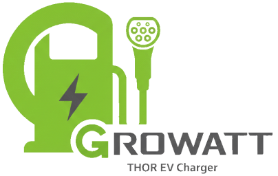
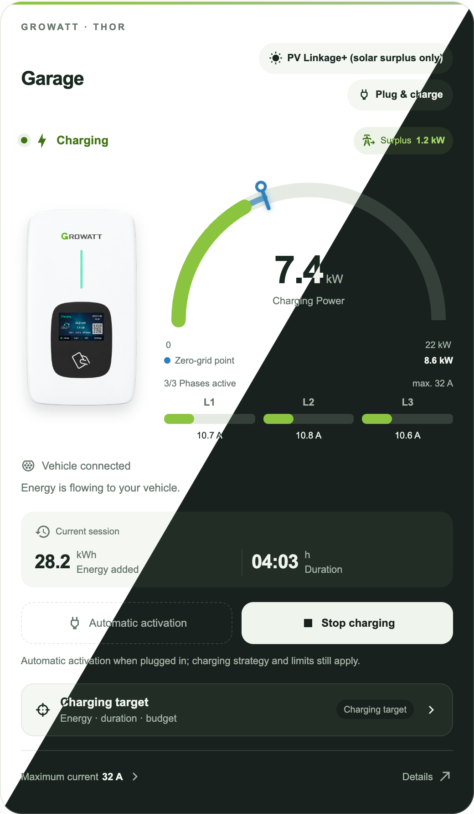

[](https://ko-fi.com/bobbesnl)

> Automatic charging stop is introduced in **2.0.0-dev.6**. In dev.5, site accounting records energy and costs without automatic stopping.

[](https://github.com/hacs/integration)


⚠️ **Please read this document first before installing this integration!**



⚡ **Unofficial Home Assistant integration for the Growatt THOR EV charger**

This integration allows you to connect a Growatt THOR EV charger **directly to Home Assistant** using **OCPP 1.6 over WebSocket**, providing local control without relying on the Growatt cloud.

<p align="center">
  <a href="docs/images/charger-light-dark-split.png"></a>
</p>

*Light at top left, dark at bottom right · English UI · Illustrative simulator data.*
Follow the [user handbook](#documentation) for numbered explanations of settings,
charging controls and session history. The [image index](docs/screenshots.md) keeps
all original screenshots.

**Version 2 aims to make everyday charging fully independent of the Growatt
smartphone app and cloud, while retaining their convenience features.** Its
development seeks to cover as much as possible of the functionality available
in current and earlier versions of the Growatt app through local Home Assistant
controls, including charging modes, schedules, charging targets and session
history.

This is the direction of development, rather than a claim of complete feature
parity. Available functionality depends on the charger and firmware; the
[usage guide](docs/usage.md) describes implemented features and their limits.

Tested on:

- THOR 22AS with firmware `THOR_22AS-V2.2.16-20240902`

The THOR family has multiple hardware generations and firmware branches.
Compatibility with another model or firmware must not be inferred from the
version number alone. See the
[hardware and firmware variants](reverse_engineering/hardware_firmware_variants.md)
for known community reports and compatibility guidance.

Do you have another Growatt EV charger? Please test it with the integration and let me know if it is working. If you open up an issue and provide logs, I will try to add your charger to be supported (Growatt only!).

> ⚠️ This is an **unofficial community project**. Growatt is not affiliated with or endorsing this integration in any way.

---

## Documentation

### User handbook

The four chapters combine instructions, annotated screenshots and numbered
explanations. Start with installation, then follow the task you want to complete.

| I want to… | Chapter |
| --- | --- |
| Install, connect or change basic settings | [Installation](docs/installation.md) |
| Start charging, manage access or set a target | [Everyday charging](docs/usage.md) |
| Configure PV, battery sensors, tariffs or automatic stop | [Energy](docs/energy.md) |
| Read charging history, export sessions or restore backups | [Sessions](docs/sessions.md) |
| Find an entity or a YAML automation example | [Entity and automation reference](docs/entities.md) |
| Diagnose a fault or delayed command | [Troubleshooting](docs/troubleshooting.md) |
| Compare all UI variants without annotations | [Screenshot index](docs/screenshots.md) |

### Understanding and changing the code

| Topic                                                            | Guide                                                            |
| ---------------------------------------------------------------- | ---------------------------------------------------------------- |
| Reading paths, glossary, local checks and comment conventions    | [Contributing](docs/CONTRIBUTING.md)                             |
| Package boundaries, state ownership and persistence invariants   | [Architecture](docs/architecture.md)                             |
| Command outcomes, timeouts and reconnect scenarios               | [Automation resilience](docs/automation-resilience.md)           |
| How source allocation and costs work, including their limits | [Site energy accounting](docs/site-energy-accounting.md)         |
| Frontend layout, simulator, generated assets and translations    | [Frontend development](frontend/README.md)                       |

### Evidence and future work

- [Reverse-engineering index](reverse_engineering/README.md): discovery notes and
  firmware-specific findings; historical plans are labelled.
- [Changelog](CHANGELOG.md): released behavior and installable milestones.
- [Future backlog](docs/backlog.md): remaining work and ideas, not a promise of
  a release or a statement that an already implemented feature is missing.

## Installation

1. Install the integration through HACS and restart Home Assistant.
2. Add **Growatt THOR** under **Settings → Devices & Services**.
3. Configure the charger to connect to the local OCPP endpoint.

Follow the [installation guide](docs/installation.md) for prerequisites, AP-mode
setup, verification and switching back to Growatt Cloud. Only one active wallbox
is supported. A changed endpoint can disable Growatt app/cloud access.

## Features

Local charger status and metering; guarded Start/Stop and configuration controls;
native targets and schedules; dashboard cards; retained session history and CSV
export; optional site energy accounting and automatic Stop. See the
[user handbook](#documentation) for individual features and limits.

## Growatt THOR dashboard card

The integration bundles its dashboard cards. After installing or updating,
restart Home Assistant, refresh the browser and choose **Edit → Add card →
Growatt THOR**. No separate frontend package or manual resource is required.

```yaml
type: custom:growatt-thor-card
name: Garage
```

See [everyday charging](docs/usage.md) for the annotated card, authorization
settings and energy, duration or budget targets. [Energy](docs/energy.md)
explains PV charging, source allocation and tariff settings.

### Session history card

```yaml
type: custom:growatt-thor-session-card
```

See [sessions](docs/sessions.md) for the desktop and mobile layouts, event
timeline, source breakdown, retained history and CSV export.

## ⚠️ Known Issues

The tested firmware can reboot or freeze under rapid writes or high OCPP traffic.
Queued writes and polling pauses reduce this risk but do not guarantee firmware
stability. See [known limitations and troubleshooting](docs/troubleshooting.md).

## Architecture

```text
Growatt THOR → local OCPP 1.6 WebSocket server → Home Assistant
```

The [architecture reference](docs/architecture.md) explains package ownership
and persistence. [Reverse-engineering notes](reverse_engineering/README.md)
record firmware-specific evidence; [CHANGELOG.md](CHANGELOG.md) records releases.

## Contributing

Start with the [contributor guide](docs/CONTRIBUTING.md) for code navigation, local checks and
documentation conventions. Reports and pull requests are welcome through
[GitHub](https://github.com/bobbesnl/growatt_thor/issues).

## Disclaimer

⚠️ **Use at your own risk**

- This software is provided AS-IS without warranty
- This is an unofficial integration not endorsed by Growatt
- Misconfiguration may:
  - Disable cloud access and Growatt app functionality
  - Interrupt charging operations
  - Require manual recovery via AP mode
  - In worst case: misconfiguration can cause fire when system is overloading! Be aware!
- The authors accept no responsibility for:
  - Damage to equipment or persons
  - Loss of functionality
  - Data loss or privacy issues
  - Electric vehicle charging issues

You are responsible for understanding the risks and ensuring safe operation.

---

## License

MIT License - see LICENSE file for details

---

## Support

- **Issues**: [GitHub Issues](https://github.com/bobbesnl/growatt_thor/issues)
- **Discussions**: [GitHub Discussions](https://github.com/bobbesnl/growatt_thor/discussions)
