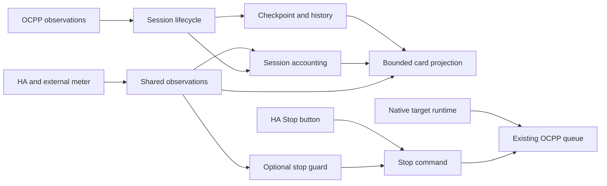

# THOR runtime architecture

[Documentation](../README.md#documentation) · [Start reading the code](CONTRIBUTING.md)

The integration supports one active wallbox and one coordinator. Existing HA
entity identities, service names, configuration keys and storage keys remain
stable. The OCPP queue remains the only owner of outbound charger writes.

## Responsibilities

Python domain packages live below `custom_components/growatt_thor/`. HA platform
entrypoints (`sensor.py`, `button.py`, `config_flow.py`, etc.), the coordinator and
shared constants remain at the integration root so HA can discover them.

| Package | Responsibility |
| --- | --- |
| `charging/` | Authorization, guarded Start/Stop, current limits and PV controls |
| `targets/` | Native target model, wire adapter, execution, dates and HA services |
| `configuration/` | Configuration values, validation and writes |
| `ocpp/` | Charge point, connection, polling requests, meter samples and diagnostics |
| `runtime/` | Write queue, runtime ownership, service setup and entity migrations |
| `sessions/` | Session lifecycle, identity, events, curves, CSV, outbox and WebSocket reads |
| `energy/` | Shared observations, energy sources, site accounting and automatic Stop |
| `presentation/` | Bounded card projection and frontend resource registration |

The TypeScript source mirrors feature boundaries in `frontend/src/`: `charger/`,
`targets/`, `authorization/`, `pv/`, `sessions/`, `energy/` and `shared/`.
`index.ts` is the production entrypoint. Each feature keeps its component,
template, styles and model together; pure calculations remain separate from
Lit lifecycle and HA calls. See [frontend development](../frontend/README.md#frontend-structure) for the source map.

## State and typing

`ChargingTargetRuntime` owns one entry's target storage, lock, busy state and
schedule timer. Its bound methods implement the unchanged target service
contract; unload cancels the timer and releases transaction callbacks.
`SessionOutbox` owns delivery state with typed persistence callbacks and validates
session identities before accepting rows. `ChargingMeterObservation` declares
the normalized telemetry shape while malformed or missing packets stay unknown.

In the frontend, `SessionDetailStore` owns historical-detail requests and a
bounded cache. It deduplicates concurrent loads, waits for an explicit retry
after errors and invalidates pending replies when the configured entry changes
or the card disconnects. Live/inline curves bypass historical detail. Known HA
attributes have explicit types; unrelated attributes are `unknown`, and entity
lookups can be absent. The TypeScript compiler checks these boundaries in strict
mode. Python typing is incremental; persisted target dictionaries remain a
validated serialization boundary rather than a fully typed state machine.

Use classes for state with a lifecycle or invariants. Keep transformations,
validation and calculations as typed functions or data models. Package initializers
stay free of runtime side effects. Domain code must not depend on HA platform
entities or frontend projections to perform charger commands.

The coordinator retains public observations, the queue, storage and OCPP meter
processing. Session transitions are delegated to `SessionLifecycle`; this is
an incremental boundary, not a replacement of the established runtime owner.

## Safety and compatibility invariants

- An accepted command does not prove a transaction started, stopped or moved
  energy. Queue status, charger observations and energy flow remain distinct.
- Stop cancels an unsent Start before considering a physical Stop. A Stop is
  tied to the observed transaction; a later transaction invalidates it.
- The automatic guard reads shared observations and calls the Stop command.
  It imports neither dashboard projection nor accounting runtime and never
  requires a registered button. It cannot automatically restart charging.
- Target services retain their public names and charging-target storage key.
  Wallbox-native energy/time limits and HA-owned repeat scheduling stay separate.
- Freshness and unit/sign normalization happen before consumers use a value.
  Missing, unavailable and stale values are not zero.
- The view contract is bounded: at most 20 recent rows, 24 events and 96 curve
  points per session, with a 12 KiB target. Historical detail is loaded on demand.
  Pagination covers those recent rows, not the full archive.

## Persistent completion

The coordinator checkpoint includes totals, the last applied record identity,
active-session state, accounting state and completed rows awaiting delivery.
The outbox saves this checkpoint before writing CSV, then saves again after
acknowledgement. A failed append keeps its row available for the next flush;
setup, later completions and shutdown retry delivery.

History operations are serialized across executor jobs. A temporary journal
contains the resulting rows and archive summary; recovery writes that result
again rather than reapplying additions. Explicit session IDs deduplicate replay;
a bounded set of 1,000 recent delivery identities also survives detail pruning.
This protects recent completion retries, not arbitrary replay of an unlimited
old stream. Legacy rows without an explicit identity keep their original
migration semantics. Backups must include HA storage, CSV, summary and any
pending journal together.

## Validation

Python regression tests cover queues, ownership, targets, upgrades, source
allocation, session recovery, interrupted retention, replay and Stop execution
without entities. Frontend checks cover formatting, types, view-model behavior
and all integration locales. Generated assets are committed and must rebuild
without a diff. CI runs both suites.

The preview uses simulated data and never contacts a charger. Unit tests and
preview checks do not replace testing on HA or real hardware. Existing target
capture evidence remains limited to the firmware named in the reverse-engineering
notes; budget enforcement remains experimental.
