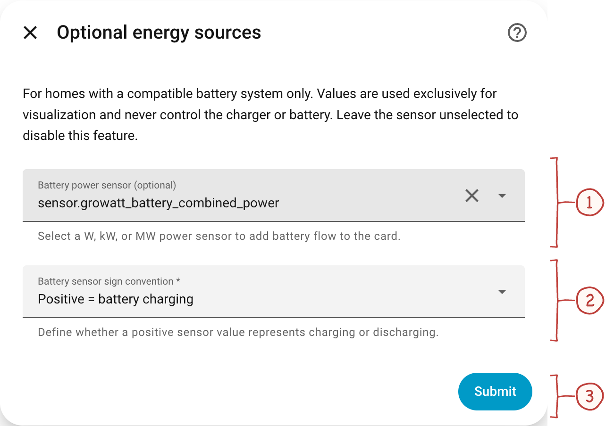
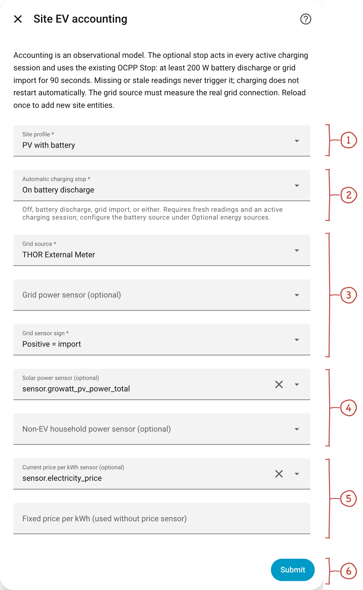
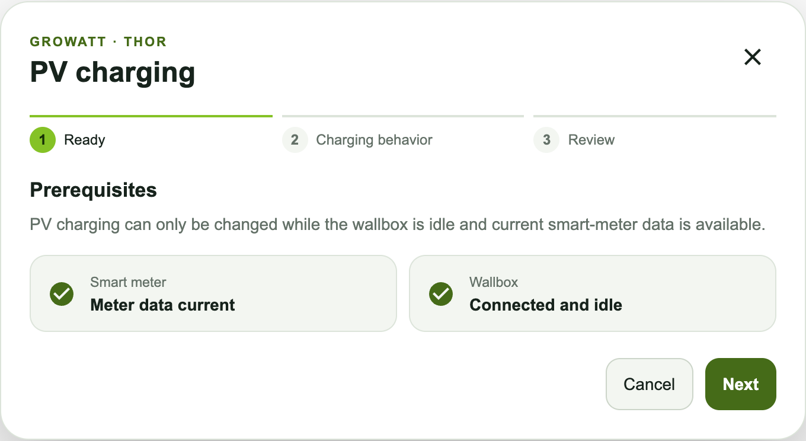
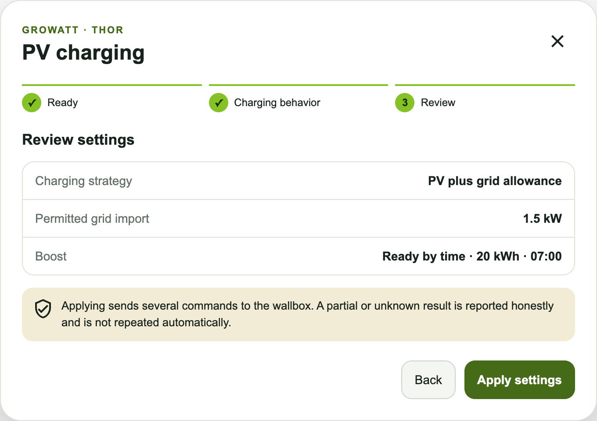

# Energy sources, solar charging and costs

[Handbook](../README.md#documentation) · [Installation](installation.md) · [Charging](usage.md) · [Energy](energy.md) · [Sessions](sessions.md)

Use this chapter to connect battery and site sensors, interpret energy shares
and costs, or configure PV charging. Accounting observes energy flows; the
optional automatic stop is a separate control that must be enabled explicitly.

- [Connect a home battery sensor](#optional-energy-sources)
- [Configure site accounting](#site-ev-energy-accounting-20-preview)
- [Understand sources and costs](#understand-energy-and-costs)
- [Enable automatic stop](#automatic-charging-stop)
- [Configure PV charging](#pv-charging-dialog)
- [Set up the HA Energy Dashboard](#energy-dashboard)

## Optional energy sources

Open **Configure → Optional energy sources**. For installations with a home
battery, select its power sensor and check the sign against a known charging
or discharging state.

1. **Battery power sensor.** Choose the sensor reporting home-battery power in W, kW or MW. Battery power is different from battery state of charge.
2. **Sign convention.** Match the sensor’s meaning: positive values can represent charging or discharging. The example uses positive = charging.
3. **Save the source.** Selecting a source alone does not enable automatic charging stops. Accounting and the stop guard are configured separately.

Clearing the source disables it once no battery-based accounting profile or
stop guard depends on it. The integration never controls the battery.

## Site EV energy accounting (2.0 preview)

Open **Configure → Site EV accounting**. The feature is off for existing
installations. Select **Grid without PV**, **PV without battery**, **PV with
battery**, or **GroHome Load First** to match the system. Battery profiles
require the source above; PV profiles require a signed grid measurement.

1. **Site profile.** Choose the topology matching your installation, such as PV with battery. The allocation is an accounting model, not physical tracking of electrons.
2. **Automatic charging stop.** Choose off, battery discharge, grid import, or either. The guard requires fresh readings and an active session; it does not restart charging automatically.
3. **Grid source and sign.** Use either the THOR External Meter or a suitable HA power sensor at the real grid connection. Set the import/export sign correctly.
4. **Solar and household power.** Select compatible power sensors where available. Household power means non-EV consumption; do not count the wallbox twice.
5. **Tariff.** Use a current price-per-kWh sensor, or a fixed price when no sensor is selected. The sensor identifier in this image is anonymized.
6. **Submit.** Applies the configuration to future accounting intervals. Missing historical source data is not reconstructed.

After first enabling accounting, reload the integration once to add its site
entities. Later configuration changes apply to future energy intervals;
old sessions are not backfilled. Settings in the image are examples, not a
universal configuration.

### Choose the right sensors

Source pickers support text search and show the friendly name, unit and entity
ID, so identically named sensors can be distinguished. Compatible units limit
the choices; sources already assigned to another flow are excluded. Existing
selections remain visible for correction, and saving rejects duplicate power
sources or invalid manually entered IDs. Battery profiles require a battery
source under **Optional energy sources**. Names help rank suggestions but do
not establish their physical role: verify the grid measurement point, use a
PV-generation sensor for solar power, and ensure household power excludes EV
charging. Choices reflect the saved configuration or the last submitted draft;
conflicts introduced while editing are checked when saving.

### Choose the tariff

Choose either a fixed price per kWh (negative prices are allowed) or a current
price-per-kWh sensor. In an EUR Home Assistant installation, both `EUR/kWh`
and `€/kWh` are accepted without changing the numeric price; `ct/kWh` is not
treated as euros. Missing power readings and stale THOR meter samples are
booked as unknown, never as zero. Available HA power sensors can retain an
unchanged value; their integration is responsible for reporting unavailability.
An unchanged current price remains usable even
if its HA update timestamp is older than an hour. Unavailable, restored or
non-finite prices and prices outside an explicitly declared validity period
are unknown. A declared active tariff timeslot takes precedence over an overall
contract period. Daily slots such as `05:00–00:00` use Home Assistant's configured
time zone, including overnight periods and seasonal clock changes; contract
start and end dates still apply. A newly observed price is not applied retroactively to earlier
energy deltas. If a price sensor is selected, its missing price does not fall
back to the fixed-price field.

## Understand energy and costs

### Charging sources on the card

The [charging card](usage.md#charging-card), number **3**, shows the live source
mix. The [session card](sessions.md#session-desktop), number **4**, shows energy
accumulated over a session. Green means direct PV, purple means battery of
unknown origin, amber means grid, and a grey hatched segment means unidentified
energy. Empty categories are omitted. [Compare the source examples](screenshots.md#charging-card-and-sources).

The wallbox's energy counter measures EV energy. Each increase is allocated
using the site readings and price valid at that time. An `≈` beside live session
energy marks a power-based estimate while no usable counter increase is available.
Old sessions remain readable with unknown accounting fields. The session card's
**About this breakdown** explains coverage, quality and the allocation rule.

This is a **documented accounting model**, not physical tracking of electrons.
The conservative default books measured grid import to EV first. GroHome Load
First declares the priority household → battery charging → EVSE → GroBoost;
it is not a measured flow or a confirmed Growatt write contract. Battery
discharge is never counted as green in this version. Green session energy is
shown only when the full session allocation is covered by valid data.

The wallbox-reported session cost, **effective grid import cost** calculated
from the price at each EV energy delta, and optional future **opportunity cost**
are distinct values. Opportunity cost is not calculated yet. Cumulative site
entities and a coverage percentage start when this feature is enabled; they do
not backfill older CSV rows. The money entity uses a total state class so negative tariffs can lower
its value. The accounting model does not control devices.

### Missing or delayed readings

THOR firmware may send meter timestamps without a UTC offset. The integration
interprets these as local time in Home Assistant's configured time zone and
normalizes new meter samples to UTC before display, accounting and automatic
stop checks. Configure HA's time zone to match the wallbox clock. Explicit
offsets are honored; invalid times, nonexistent spring-transition times and
ambiguous autumn-transition times without an offset are rejected. The original
timestamp remains in the raw diagnostic payload. Receipt time never replaces
a missing or stale measurement time. Existing historical rows are not rewritten.

The live gauge evaluates current site readings, since the wallbox,
inverter and battery sensors update independently. Historical accounting still
uses the measurement time. Energy across a long telemetry gap remains unknown
instead of being attributed to today's power split or price.

## Automatic charging stop

In the accounting dialog, number **2** controls the stop guard.

An **optional automatic charging stop** can be enabled in the same site
settings after choosing a site profile. Its modes are battery discharge, grid
import, or either; the default is off. It acts in every charging mode while
the THOR reports an active transaction and fresh OCPP charging power. A
selected source must report at least 200 W for 90 seconds. The integration
then sends the existing transaction-bound OCPP Stop command once and does not
restart charging. A missing, unavailable or stale source cannot trigger the
stop. Configure the battery sensor and confirm its sign under **Optional energy
sources**. Use a grid sensor at the actual grid connection, not a branch meter:
the THOR's meter placement behind the inverter meter can hide battery
discharge even while its own grid value is zero. The stop is a supplementary
local control, not a charger or inverter guarantee; verify the sensor values
and stop behavior on site before relying on it.

For an example of source coverage and the calculation rules, see [How EV energy and costs are calculated](site-energy-accounting.md).

## PV charging dialog

Open the charging-mode badge to configure **PV Linkage+** (only PV surplus) or
**PV Linkage** (PV plus a configured grid allowance). The first step verifies a
current external-meter reading and an idle, connected wallbox. The last step
summarizes the draft before it is sent. These are simulator screenshots of the
PV wizard; they do not imply a separate Fast-mode selection inside this dialog.

<table>
<tr>
<td valign="top"> 19. Charging mode · prerequisites</td>
<td valign="top"> 26. Charging mode · review before applying</td>
</tr>
</table>

Between those steps, choose **No boost**, **Time window**, or **Ready by time**.
Boost can deliberately draw grid power even with PV Linkage+. “Ready by time”
is an energy target with a finish-by deadline; the native charging-target
scheduler in the [usage guide](usage.md#charging-target-dialogs) sets a start time.

[Compare all six PV/boost combinations](screenshots.md#pv-charging-modes).

## Energy Dashboard

This integration is compatible with the Home Assistant Energy Dashboard.

### Setting up EV Charging tracking

1. Go to **Settings → Dashboards → Energy**
2. Scroll to **Individual device consumption**
3. Click **Add device**
4. Select `sensor.growatt_thor_ev_charger_energy_charged`

> **Note:** This sensor has `state_class: total_increasing`, meaning it resets to zero after each charging session. Home Assistant automatically detects these resets and accumulates all sessions correctly in the Energy Dashboard — including multiple sessions on the same day.

### Additional sensor (optional)

For real-time power monitoring on the Energy Dashboard:

- Use `sensor.growatt_thor_ev_charger_charging_power` for live wattage display
