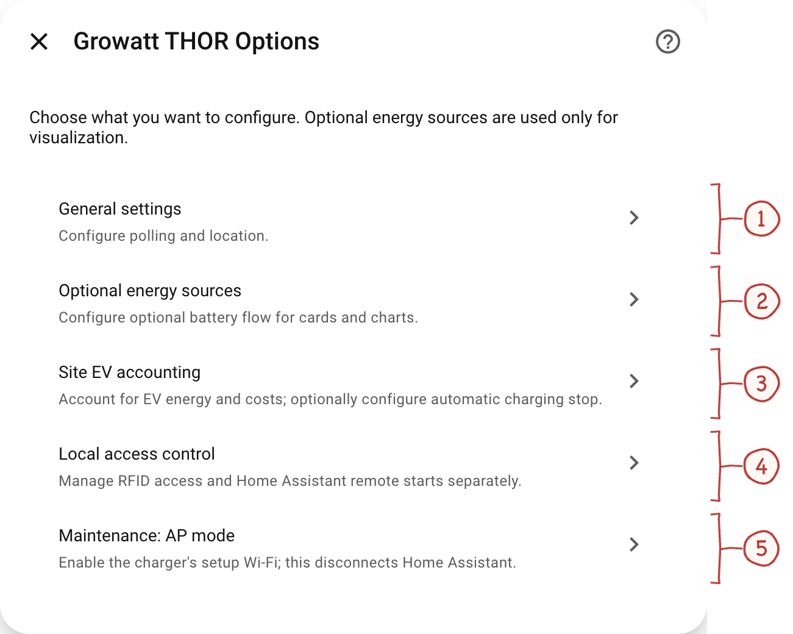
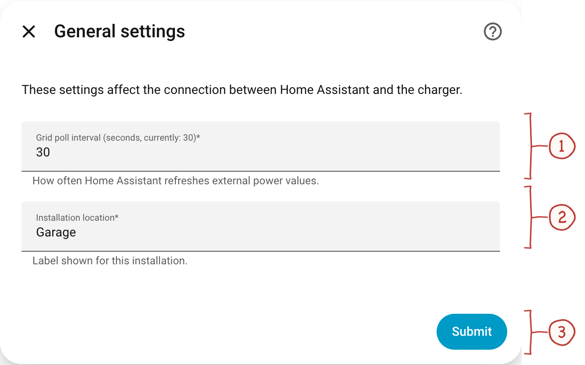
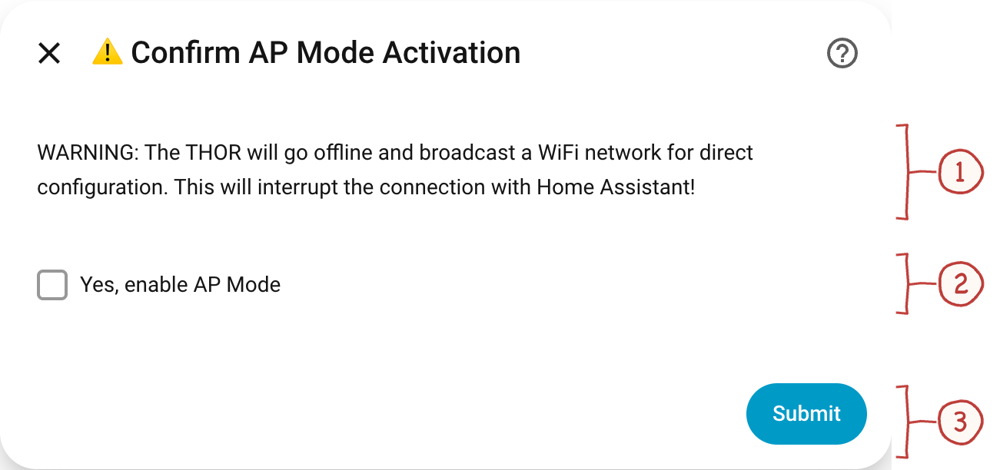

# Installation and charger connection

[Handbook](../README.md#documentation) · [Installation](installation.md) · [Charging](usage.md) · [Energy](energy.md) · [Sessions](sessions.md)

Read the [known firmware limitations](troubleshooting.md#known-firmware-limitations) before changing the charger endpoint.

## Before you start

- Home Assistant (2024.4.1 or newer recommended)
- HACS (Home Assistant Community Store) installed (minimum v1.34.0 but most latest version is recommended)
- Working Growatt THOR EV Charger setup --> Fully configured to work with your (hybrid) inverter and with a working network connectivity to Growatt cloud (Shinephone app)
- Network access between Home Assistant server and the charger

## Install with HACS

1. **Install the integration**
   - Open **Home Assistant**
   - Go to **HACS → Integrations**
   - Click **Explore & Download Repositories** (wording may differ per HACS version)
   - Search for **Growatt THOR** (or **Growatt THOR EV Charger**)
   - Click **Download**
   - Restart Home Assistant

### Add a custom repository if needed

Use this if you cannot find the integration in the default HACS list yet, or if you intentionally want to install from a fork/branch.

1. **Add custom repository**
   - Open **Home Assistant**
   - Go to **HACS → Integrations**
   - Click **⋮** (three dots) → **Custom repositories**
   - Add repository:
     - **URL**: `https://github.com/bobbesnl/growatt_thor`
     - **Category**: `Integration`
   - Click **Add**

2. **Install the integration**
   - Search for **Growatt THOR** (or **Growatt THOR EV Charger**) in HACS
   - Click **Download**
   - Restart Home Assistant

## Add the integration

1. Go to **Settings → Devices & Services**
2. Click **+ Add Integration**
3. Search for **Growatt THOR**
4. Configure:
   - **Listen Port**: `9000` (default, or choose your own)
   - **Location**: Installation address used in session exports
   - **Grid Poll Interval**: `30` seconds (recommended)
     - Minimum: 5 seconds
     - Lower values = more frequent updates (higher load on THOR)
     - Higher values = less frequent updates (lower load)
     - **Important**: This only affects display update frequency, not load balancing functionality
5. Click **Submit**

Home Assistant is now ready and waiting for the charger to connect.
Continue with [connecting the charger](#configuring-the-growatt-thor-charger),
then add the [charging card](usage.md).

## Find and update settings

Open **Settings → Devices & Services → Growatt THOR → Configure**.
The numbered screenshots below show where each setting lives. Numbers restart
in each image. The installation address and personal tariff identifier are
anonymized; [capture details and original images](screenshots.md) are available
in the image index.

### Options menu

<a id="ha-menu"></a>

<a href="images/annotated/ha-menu.png"></a>

1. **General settings.** Set the polling interval and installation label.
2. **Optional energy sources.** Select the home-battery power sensor and its sign convention.
3. **Site EV accounting.** Configure energy allocation, tariff inputs and the optional automatic charging stop.
4. **Local access control.** Manage physical RFID access separately from starts initiated by Home Assistant.
5. **Maintenance: AP mode.** Opens a confirmation before enabling the charger’s setup Wi-Fi. Activation interrupts its connection to Home Assistant.

Go to [energy settings](energy.md) for battery sensors, accounting and automatic
stop, or [local authorization](usage.md#local-charging-authorization) for RFID
and Home Assistant permissions.

### General settings

<a id="ha-general"></a>

<a href="images/annotated/ha-general.png"></a>

1. **Polling interval.** Controls how often Home Assistant refreshes external power values. This is not the wallbox’s load-balancing interval.
2. **Installation location.** The installation label used in session exports. “Garage” replaces the private address in this documentation image.
3. **Submit.** Saves the edited settings. Close the dialog to discard unsaved changes.

## Configuring the Growatt THOR Charger

### ⚠️ Important Notes

- Changing the server URL will **disconnect the charger from Growatt cloud**
- You will **lose access to the Growatt app** while using this integration
- Make sure you know how to **restore the original settings** via AP mode
- **Test the server URL** before saving to avoid lockout

### Configuration Methods

#### Method 1: Via AP Mode (Most Reliable)

If the charger is already connected to Home Assistant, open
**Configure → Maintenance: AP mode**. Otherwise use the charger's supported
setup method, such as the Growatt app. The HA confirmation works as follows:

<a id="ha-ap-mode"></a>

<a href="images/annotated/ha-ap-mode.png"></a>

1. **Read the warning.** AP mode makes the charger broadcast its setup Wi-Fi and interrupts its Home Assistant connection.
2. **Explicit confirmation.** Opening this dialog does nothing to the charger. Activation requires checking this box and submitting.
3. **Activate or cancel.** Submit activates AP mode only after confirmation. Use the close icon to leave without activating it.

Access methods and credentials vary between THOR hardware and firmware
variants. `12345678` is a documented default for the Wi-Fi access point on
older devices, but it is not guaranteed for every device or for the port 8080
web interface. See the
[hardware and firmware variants](../reverse_engineering/hardware_firmware_variants.md).

1. **Enable AP Mode** on the Growatt THOR charger (via Shinephone app)
2. Connect your phone to the THOR's Wi-Fi using its configured credential (`12345678` is the documented default on older devices)
3. Open the **ShinePhone** or **Growatt** app
4. Navigate to **Network Settings** or **Server Settings**
5. Change the **Server URL** to:
   ```
   ws://<HOME_ASSISTANT_IP>:9000/ocpp/ws
   ```
   Example: `ws://192.168.1.101:9000/ocpp/ws`
6. **Save** and **reboot** the charger
7. Reconnect the charger to your normal Wi-Fi network

#### Method 2: Via Web Interface (Some Models)

Some Thor models have a web interface accessible via LAN cable:

1. Connect a network cable to the Thor charger
2. Set a static IP on your computer (e.g., `192.168.1.13`)
3. Open a browser and navigate to `http://192.168.1.5:8080`
4. Change the server URL as described above
5. Save and reboot

### Verification

After configuration, check Home Assistant:

- Go to **Settings → Devices & Services**
- The Growatt THOR device should appear with status "Connected"
- Sensors should start showing live data

---

## Switching Back to Growatt Cloud

If you need to restore cloud connectivity:

### Via AP Mode

1. Enable **AP Mode** on the charger. Best practice to do so is set up a TCP forwarder (see underneath), connect to charger via ShinePhone app (delete existing THOR and add again to regain acces)
2. Connect to the charger's Wi-Fi
3. Open the Growatt app
4. Restore the original server URL:
   ```
   ws://evcharge.growatt.com:80/ocpp/ws
   ```
5. Save and reboot

### Emergency Fallback: TCP Forwarder

If you're locked out and need temporary cloud access:

1. Install **Advanced SSH & Web Terminal** add-on in Home Assistant
2. Install `socat`:
   ```bash
   apk add socat
   ```
3. Run TCP forwarder:
   ```bash
   /usr/bin/socat TCP-LISTEN:9000,fork,reuseaddr TCP:evcharge.growatt.com:80
   ```
4. This forwards traffic from port 9000 to Growatt cloud
5. Charger will reconnect to cloud via Home Assistant
6. Use Growatt app to restore original server URL
7. Stop socat and restore this integration

⚠️ **Note**: If you get "address in use" errors, temporarily remove the integration and restart Home Assistant before running socat.

---
