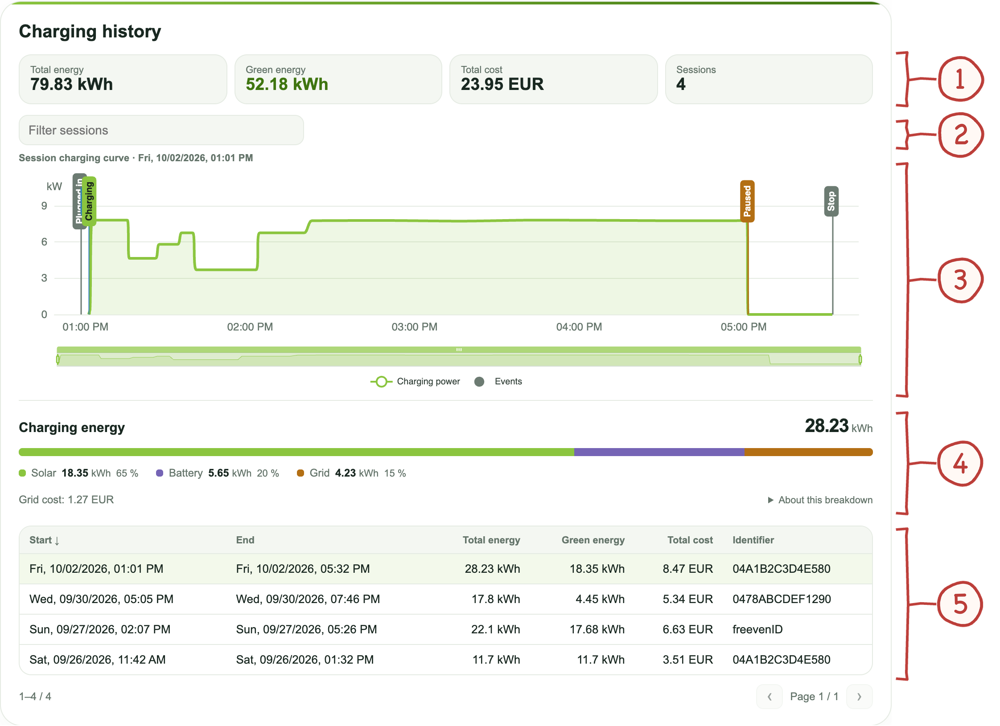
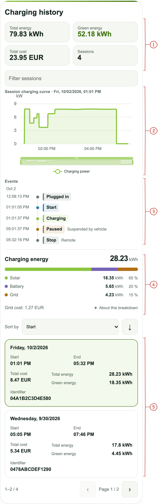

# Session history and exports

[Handbook](../README.md#documentation) · [Installation](installation.md) · [Charging](usage.md) · [Energy](energy.md) · [Sessions](sessions.md)

Add **Growatt THOR Session History** to a dashboard, or use:

```yaml
type: custom:growatt-thor-session-card
```

The history card helps you review completed sessions and an optional active
session. Its row setting controls page size. Pages cover the recent summaries
published to the card (up to 20, sometimes fewer because of the status size
limit); use [CSV export](#exporting-session-data) for the retained archive.

- [Read the desktop card](#session-desktop)
- [Use the mobile layout](#session-mobile)
- [Understand pauses and missing energy data](#vehicle-and-wallbox-pauses)
- [Export sessions](#exporting-session-data)
- [Back up and restore history](#backups-and-recovery)

## Read the desktop card

Red numbers match the explanations below each image. The example sessions,
source shares, prices and RFID identifiers are simulated. They do not reconstruct
missing data from an actual installation. [Original light, dark and mobile screenshots](screenshots.md#session-history)
are available in the image index.

<a id="session-desktop"></a>

<a href="images/annotated/session-desktop.png"></a>

1. **History totals.** Completed-session totals: energy, known green energy, reported cost and session count. Missing green values are not estimated.
2. **Filter.** Search session dates or identifiers. Sorting and paging remain available in the table.
3. **Selected session curve.** Shows the power history and recorded events. Use the timeline zoom to inspect a period; event colors have the same meaning as in the mobile list.
4. **Charging energy breakdown.** Source shares and kWh for the selected session. Grid cost is separate from the wallbox-reported total cost. Open “About this breakdown” for allocation details.
5. **Session table.** Select a row to inspect that session. RFID identifiers shown here are fictitious. The same information becomes a card list at narrow widths.

Totals include archived completed-session totals. Green energy adds only known
values: direct solar energy from fully allocated sessions. Unknown battery
origin is not classified as green, and missing historical values are not
estimated. See [energy and cost semantics](energy.md#understand-energy-and-costs).

## Use the mobile layout

At a card width of 600 px or less, the table becomes a selectable card list and
event markers move below the chart. This also applies to narrow dashboard
columns on desktop. Resizing preserves selection, filters, zoom, legend choices
and expanded gaps in multi-day sessions.

<a id="session-mobile"></a>

<a href="images/annotated/session-mobile.png"></a>

1. **History totals.** The same completed-session totals as the desktop card, arranged in two columns.
2. **Charging curve and zoom.** Time labels adapt to the available width. The zoom control selects the part of the curve to inspect.
3. **Event timeline.** Connected colored dots show event order. The pills identify the event, while reasons such as “Suspended by vehicle” or “Remote” sit beside them. This list covers the whole selected session.
4. **Energy sources.** The split bar and legend show source shares and absolute energy. Empty categories are omitted; unidentified energy is shown explicitly when present.
5. **Session items.** On the same day, one date heading covers start and end. Overnight sessions keep both dates. Cost is on the left; total and green energy are aligned on the right. Tap an item to select it.

The event list covers the whole selected session even when the plot is zoomed;
longer lists scroll independently. Exact timestamps and provisional labels remain
visible. On wider cards, events stay inside the chart.

## Understand the energy breakdown

The split bar shows energy by source, with kWh and percentages in its legend.
Empty categories are omitted. **About this breakdown** explains missing data,
battery origin and the allocation rule. Grid cost is hidden when no energy could
be assigned to a source; partial allocation shows **Known grid cost**. This is
separate from the wallbox-reported total session cost.

## Vehicle and wallbox pauses

A `SuspendedEV` or `SuspendedEVSE` status notification adds a confirmed pause
event to the active session, even if the charger sends no final zero-power
sample. Its timestamp is when Home Assistant received the status, and its
translated reason identifies the vehicle or wallbox. Repeated notifications
do not duplicate the event. The transaction stays open; later measured power
can mark a charging resume. A pause does not establish that the battery is full.

When current readings are absent during a reported pause, the charger card shows
**Paused** and the reason instead of **No data** and a stale-meter warning.
Readings from before suspension are not shown as current charging power. Unknown
power and phase currents remain unknown rather than being replaced with zero.
Earlier pauses without a recorded status or meter transition cannot be dated
retroactively.

## Stored fields

After each completed charging session, the following data is automatically appended to `/config/growatt_thor_sessions.csv`:

| Field                        | Description                                                                       |
| ---------------------------- | --------------------------------------------------------------------------------- |
| `charger_id`                 | Unique charger identifier (serial number)                                         |
| `location`                   | Charger address as configured during setup                                        |
| `start_time`                 | Charging session start time                                                       |
| `end_time`                   | Charging session end time                                                         |
| `energy_kwh`                 | Energy delivered during session (kWh)                                             |
| `cost`                       | Session cost as reported by charger                                               |
| `duration_minutes`           | Session duration in minutes                                                       |
| `effective_charging_minutes` | MeterValues-based time with actual energy transfer; blank for historical sessions |
| `transaction_id`             | OCPP transaction ID                                                               |
| `session_id`                 | Stable internal ID with an `ha-`, `ext-`, or `legacy-` prefix                     |
| `session_source`             | `home_assistant`, `external_or_unknown`, or `legacy_unknown`                      |

The OCPP `transaction_id` remains unchanged for protocol-level analysis. The
additional `session_id` prevents equal numeric IDs assigned by different
central systems from colliding in exports. Existing CSV files are extended on
the next completed session. Since their original source cannot be reconstructed
reliably, historical rows are marked `legacy_unknown`.

Detailed CSV rows are retained for 365 days and capped at the newest 1,000
sessions. When older rows are pruned, their energy, green-energy, cost and
session-count totals are carried forward in
`/config/growatt_thor_sessions.summary.json`; the history card KPIs therefore
do not decrease. The card publishes only compact recent summaries in the
status entity and loads an older retained curve when that row is selected.

## Location in exports

The **Location** field is included in session exports. If your reporting process
requires an exact installation address, enter it there; otherwise use a suitable
installation label.

Update it under **Settings → Devices & Services → Growatt THOR → Configure → General settings** (number **2** in the [settings screenshot](installation.md#ha-general)).

## Exporting session data

Use the built-in action to export sessions for a specific date range:

**Via Developer Tools → Actions:**

```yaml
action: growatt_thor.export_sessions
data:
  date_from: "2026-01-01"
  date_to: "2026-12-31"
```

After the action completes, a notification appears in Home Assistant with a direct download link to the generated CSV file.

**Note:** The export file is saved to `/config/www/` and is accessible via `/local/` in your browser. The file is named `growatt_thor_export_YYYY-MM-DD_YYYY-MM-DD.csv`.

**Note:** for spreadsheet users: When opening the CSV in LibreOffice Calc or Microsoft Excel, ensure the decimal separator is set to . (dot) to correctly display energy values such as 0.068.

## Lovelace export panel

**Add a export panel for a convenient export interface without needing Developer Tools**

First add this script: **Settings -> Automations and scenes -> Scripts -> Add script**

```yaml
alias: Growatt Export Sessions
sequence:
  - action: growatt_thor.export_sessions
    data:
      date_from: "{{ states('input_text.growatt_export_date_from') }}"
      date_to: "{{ states('input_text.growatt_export_date_to') }}"
mode: single
```

Then add the required helpers in **Settings → Helpers → Add Helper → Text:**

- **input_text.growatt_export_date_from** — default value: current year start e.g. 2026-01-01
- **input_text.growatt_export_date_to** — default value: today e.g. 2026-12-31

Add this card to your dashboard:

```yaml
type: vertical-stack
cards:
  - type: markdown
    content: |
      ## 📋 Export Charging Sessions
      Fill in the date range and press **Export** to generate a CSV download.
  - type: entities
    entities:
      - entity: input_text.growatt_export_date_from
        name: From (YYYY-MM-DD)
      - entity: input_text.growatt_export_date_to
        name: To (YYYY-MM-DD)
  - type: button
    name: Export Sessions
    icon: mdi:file-download-outline
    tap_action:
      action: call-service
      service: script.growatt_export_sessions
```

Example Export Output:

```csv
charger_id,location,start_time,end_time,energy_kwh,cost,duration_minutes,transaction_id,session_id,session_source,effective_charging_minutes
XGJ00003214700CA,"Kerkstraat 1, 1234 AB Amsterdam",2026-03-21 08:19:03,2026-03-21 09:42:02,3.170,0.63,83.0,1,ha-0123456789abcdef,home_assistant,79.5
XGJ00003214700CA,"Kerkstraat 1, 1234 AB Amsterdam",2026-03-22 07:05:11,2026-03-22 08:31:44,8.450,1.69,86.5,2,ext-fedcba9876543210,external_or_unknown,
```

## Backups and recovery

Completed sessions are checkpointed before CSV delivery. Explicit session IDs
make repeated delivery idempotent across restarts; recent delivery receipts
remain bounded to 1,000 identities. CSV updates and retention use a recovery
journal so an interrupted rewrite cannot add archive totals twice. Keep the HA
integration storage, session CSV, summary JSON and any pending retention JSON
together when backing up or restoring. Existing stores without these new
fields continue to load. Missing historical accounting values remain unknown.

The [architecture reference](architecture.md#persistent-completion) explains the checkpoint, outbox and recovery journal.
