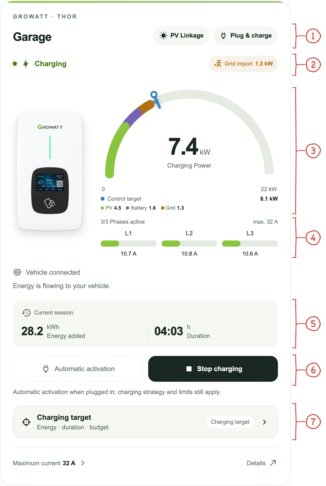
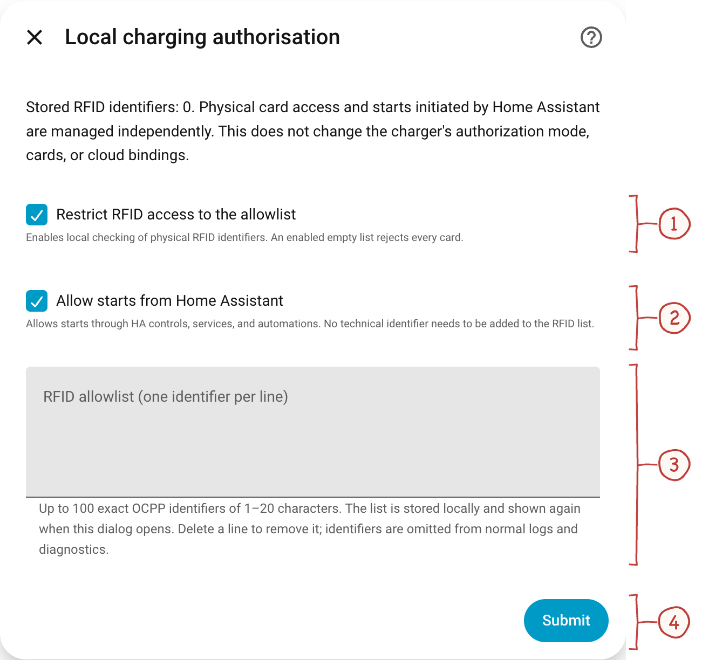
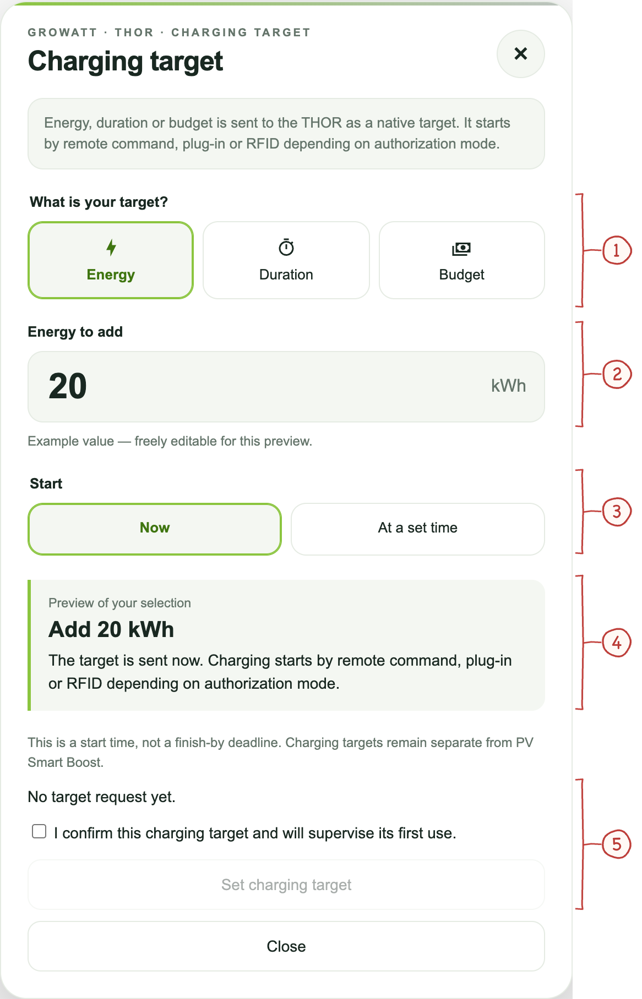
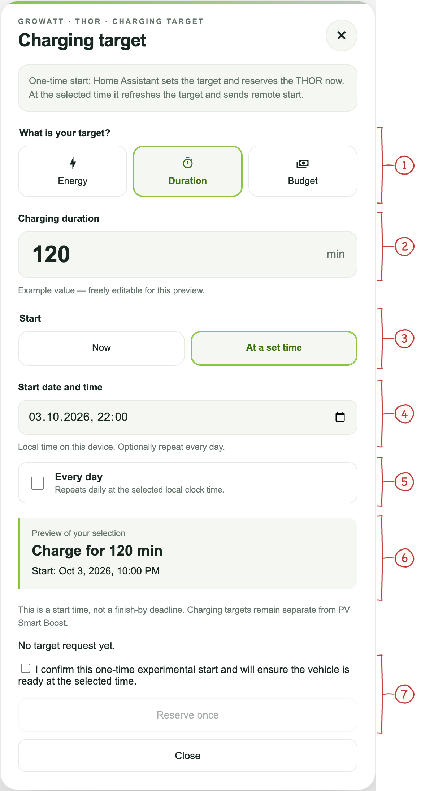
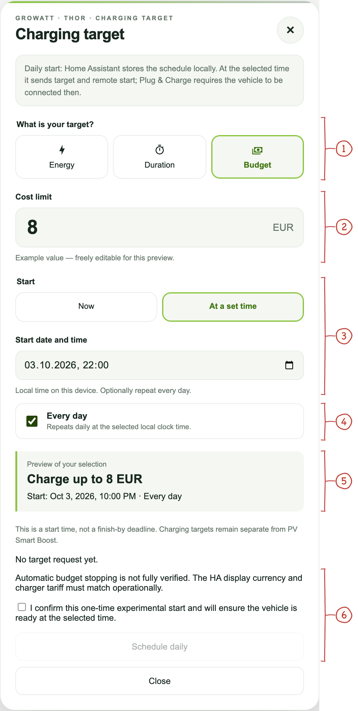

# Everyday charging

[Handbook](../README.md#documentation) · [Installation](installation.md) · [Charging](usage.md) · [Energy](energy.md) · [Sessions](sessions.md)

Start here after [installing the integration](installation.md). Add the bundled
card through **Edit dashboard → Add card → Growatt THOR**. After updating,
restart Home Assistant and refresh the browser; no separate frontend package or
manual JavaScript resource is needed. With one THOR status sensor, the card
finds the integration automatically. Use the visual editor to select a specific
installation, name, theme, gauge ceiling and optional sections.

```yaml
type: custom:growatt-thor-card
name: Garage
max_power: 22
```

- [Read and operate the charging card](#charging-card)
- [Choose how charging is authorized](#local-charging-authorization)
- [Set an energy, duration or budget target](#native-charging-targets)
- [Configure PV charging and energy sources](energy.md)
- [Review sessions and export data](sessions.md)

## Read the charging card

The red numbers match the explanations below each image. Screenshots use
illustrative values; [all original images and capture details](screenshots.md)
are available separately.

<a id="charging-card"></a>

<a href="images/annotated/charging-card.png"></a>

1. **Charging and authorization modes.** Open the badges to review or change charging strategy and how a session is authorized.
2. **Status and grid balance.** The left label is the charger state. The right badge describes site grid import or export, not total charging power.
3. **Power and charging sources.** The gauge shows EV charging power. Green, purple and amber indicate direct PV, battery and grid contributions. The blue marker indicates the control target; battery origin remains unknown.
4. **Phase currents.** See active phases and current per phase, alongside the configured maximum.
5. **Current session.** Energy added and elapsed session duration. A vehicle pause does not necessarily end the transaction.
6. **Charging controls.** Available controls depend on the authorization mode and charger state. Stop charging requests an OCPP stop.
7. **Charging target.** Open the target dialog for an energy, duration or budget target and its start schedule.

A queued or accepted command is not yet a confirmed physical state. Wait for
the card to report the outcome before issuing another command. During a
vehicle or wallbox pause, the transaction can remain open; see
[pause states](sessions.md#vehicle-and-wallbox-pauses). Missing readings stay
unknown instead of being displayed as zero.

With **Plug & charge**, a connected vehicle can also be started manually after
a completed stop, including an energy-protection stop. The card enables
**Start charging** once the previous transaction has ended and the charger is
ready. The command requests a new session without changing PV Linkage, boost
settings or current limits; it does not guarantee immediate power delivery.
**Stop charging** stays disabled while there is no active transaction.
RFID-only mode continues to require a physical card. Active or unresolved
charging targets and an unavailable HA start entity can still block the button;
an old target attempt blocked before it was sent no longer blocks manual Start.

## Local charging authorization

There are two independent settings: the **wallbox authorization mode** decides
how charging starts, while Home Assistant's **local access policy** decides
which RFID and remote-start requests it accepts.

### Choose the wallbox authorization mode

Open the authorization badge on the card (number **1**) and choose
**Home Assistant / RFID**, **RFID only**, or **Plug & charge**. Review the
confirmation: changing mode can reboot the charger, and Plug & Charge can
start charging immediately when a vehicle is connected.

[Compare the three authorization dialogs](screenshots.md#authorization).

### Manage local access

Open **Settings → Devices & Services → Growatt THOR → Configure → Local access control**.
Existing installations remain open until restriction is enabled.

<a id="ha-authorization"></a>

<a href="images/annotated/ha-authorization.png"></a>

1. **Restrict RFID access.** When enabled, only identifiers on the local allowlist are accepted. An enabled empty list rejects every physical card.
2. **Allow Home Assistant starts.** A separate permission for starts through HA controls, services and automations. Their technical identifiers need not be added to the RFID list.
3. **RFID allowlist.** Enter one exact OCPP identifier per line. These are sensitive access identifiers; the screenshot intentionally contains none.
4. **Submit.** Saves the local policy. This does not change the wallbox’s authorization mode or cloud bindings and does not stop an active session.

The editable allowlist is stored in the integration's configuration and included
in Home Assistant backups. Identifiers are omitted from normal logs and
downloaded diagnostics. See the [authorization evidence and limits](../reverse_engineering/local_authorization.md)
for firmware-specific details.

## Native charging targets

Open **Charging target** on the card (number **7**). Choose what to limit, then
when to start:

| Target | Unit | Meaning |
| --- | --- | --- |
| Energy | kWh | Energy to add in this charging session |
| Duration | minutes | Requested charging duration |
| Budget | displayed currency | Experimental native cost limit |

**Now** sends the target immediately. **At a set time** offers either a one-time
reservation or **Every day**, a schedule stored and run by Home Assistant.
A scheduled start is not a finish-by deadline; [PV Smart Boost](energy.md#pv-charging-dialog)
is a separate feature. Starts depend on authorization mode, vehicle readiness
and the charger. The dialog explains prerequisites and reports acceptance or
uncertainty.

Energy and duration enforcement have been verified only on the documented
THOR 22AS firmware. Budget stopping and currency semantics remain experimental.
Unresolved target requests block ordinary starts until reconciled; requests
are retained across restarts and are not retried automatically. See
[charging-target evidence and limits](../reverse_engineering/charging_targets.md)
when using the corresponding HA actions.

### Charging target dialogs

The three examples below explain the shared controls. The [screenshot index](screenshots.md#charging-targets)
contains all nine combinations of target type and start schedule.

#### Add energy now

<a id="target-energy"></a>

<a href="images/annotated/target-energy.png"></a>

1. **Target type.** Choose energy, duration or budget. Each has its own unit and limits.
2. **Energy to add.** Requested energy in kWh. This is an energy target for the session, not a vehicle battery percentage.
3. **Start now.** The target is sent now. Actual charging starts according to authorization mode, vehicle readiness and the supported charger behavior.
4. **Selection preview.** Review the amount and start behavior before sending the request.
5. **Confirmation and action.** Read the status, confirm the request and use “Set charging target”. A submitted request is not itself proof of charger acceptance.

#### Reserve a one-time duration target

<a id="target-duration"></a>

<a href="images/annotated/target-duration.png"></a>

1. **Duration target.** Choose Duration for a time-based charging target.
2. **Charging duration.** Enter the requested duration in minutes. This differs from choosing when charging should start.
3. **At a set time.** Switch from immediate to scheduled start.
4. **Start date and time.** The scheduled start is in the device’s local time. It is a start time, not a finish-by deadline.
5. **Every day unchecked.** Leave this unchecked for a one-time reservation. Enable it for a daily start instead.
6. **Review the reservation.** Check target duration and the scheduled date and time.
7. **Confirm and reserve.** Read the current status and confirmation before “Reserve once”. One-time reservations are experimental and subject to the readiness requirements in the usage guide.

#### Schedule a daily budget target

<a id="target-budget"></a>

<a href="images/annotated/target-budget.png"></a>

1. **Budget target.** Choose Budget for a cost-based native charging target.
2. **Cost limit.** Enter the budget in the displayed currency. The Home Assistant display currency and charger tariff must match operationally.
3. **Scheduled start.** Select “At a set time” and choose the local start date and time.
4. **Every day enabled.** Repeat at the selected local clock time. Home Assistant stores and runs this daily schedule.
5. **Selection preview.** Check the budget, time and daily recurrence before scheduling.
6. **Experimental behavior and confirmation.** Automatic stopping at the budget is not fully verified. Read the warning and confirmation before “Schedule daily”. This is separate from PV Smart Boost.

## More controls and troubleshooting

Use the [entity and automation reference](entities.md) for maximum-current
controls, reported configuration values, diagnostics and YAML examples.
For unavailable readings, delayed commands or firmware limitations, follow
[troubleshooting](troubleshooting.md).
